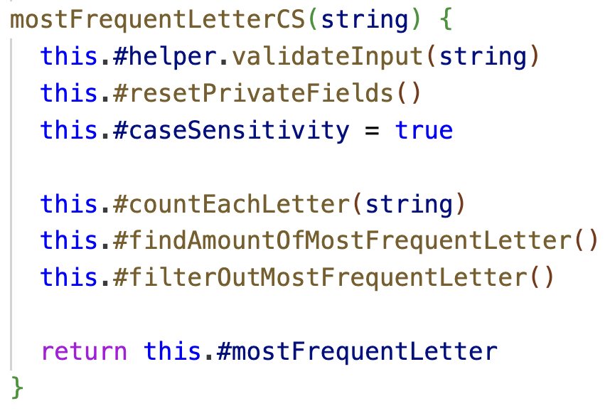

# Reflektioner

## Tabellreflektion namngivning

<table>
  <thead>
    <tr>
      <th>Namn</th>
      <th>Förklaring</th>
      <th>Reflektion och regler från Clean Code</th>
    </tr>
  </thead>
  <tbody>
    <tr>
      <td><code>mostFrequentLetter</code>, <code>mostFrequentLetterCS</code></td>
      <td>Publika metoder i MostFrequentLetterFinder.js   Alltför små skillnader i identifierares namn.</td>
      <td><b>Avoid Disinformation</b>: Jag använder två snarlika namn på två metoder från samma klass. Detta kan sägas bryta mot regeln att inte ha för små skillnader mellan två identifierares namn. CS står i detta fall för Case Sensitive. Jag bedömde att läsbarheten blev sämre när jag döpte den till <code>mostFrequentLetterCaseSensitive</code> samt att skillnaden i namnen är ganska lätt att upptäcka i och med att skillnaden står sist i ordet. Alltså behöll jag namnen såsom beskrivet.</td>
    </tr>
    <tr>
      <td><code>splittedArray</code></td>
      <td>Namn på konstant i <code>makeFirstLetterCapital()</code> i StringTransformer.js  Redundant "Noise word"</td>
      <td><b>Make Meaningful Distinctions</b>: Boken föreskriver att ord som <em>variable</em> och <em>table</em> inte ska förekomma i ett variabelnamn respektive tabellnamn. Här bryter jag alltså mot den regeln.</td>
    </tr>
    <tr>
      <td><code>createReturnObject(onlyUniqueWords)</code></td>
      <td>Metodnamn och namnet på dess argument.</td>
      <td><b>Use Pronounceable Names:</b> Den absoluta majoriteten av min kod går att läsa som fullständiga engelska ord som är sammansatta till namn på variabler, metoder, attribut och parametrar. Möjligt undantag: <code>regExp</code>, men det är ett vedertaget begrepp inom programmering.</td>
    </tr>
    <tr>
      <td><code>amountOfMostFrequentLetter</code></td>
      <td>Medlemsvariabel i MostFrequentLetterFinder.</td>
      <td><b>Use Searchable Names:</b> Jag använder generellt ganska långa variabelnamn vilket underlättar sökning efter dem. Ett undantag är användandet av <code>i</code> som indexräknare i en for-loop. Men det är ett vedertaget förfarande som också bokens författare använder sig av.</td>
    </tr>
    <tr>
      <td><code>PhraseCounter</code>, <code>makeFirstLetterCapital</code></td>
      <td>Klassnamn och metodnamn.</td>
      <td><b>Class Names:</b> Alla klassnamn är substantiv och börjar med versal.   <b>Method Names:</b> Majoriteten av alla metoder startar med ett verb.</td>
    </tr>
  </tbody>
</table>

## Kapitelreflektion kapitel 2 "Meaningful Names"

Jag håller inte med författaren om att variabeltyp aldrig ska återspeglas i namnet. Min uppfattning är att det verkligen kan tillföra tydlighet just i JavaScript. I fallet `splittedArray` i tabellen ovan hade en annan programmerare behövt veta att `String.prototype.split()` returnerar en array. I Java hade behovet inte funnits på samma sätt i och med att typen alltid skrivs ut.

Jag gillar att vi uppmanas att inte vara rädda för långa namn. Under kodandets gång märkte jag att tydligheten kring vad en variabel är eller en funktion gör ofta vinner över eventuell nedsatt läsbarhet.

Stycket **Don't Be Cute** stack ut en del på ett lustigt sätt. Jag har aldrig ens kommit på tanken att döpa funktioner och variabler till något humoristsikt men tydligen har författaren stött på det eftersom det tas upp. Så det blir inte svårt att följa den regeln.

Jag gillar tankegången i stycket **Use Pronouncable Names** där det sägs att programmering är en social aktivitet och att ord som är möjliga att uttala underlättar den kommunikationen. Det är en bra poäng men något som är lätt att glömma bort när man sitter som ensam utvecklare och dessutom på distans.

Boken har fått mig att tänka till mer kring hur jag namnger variabler och funktioner. Jag stannar kvar längre i namngivningsögonblicken och lägger mer tid på att komma på bra namn. Jämfört med tidigare ändrar jag namn i större utsträckning nu och försöker att optimera namngivningen. Exempelvis från detta projekt: `sortedLetters` --> `countedLetters` --> `countedCharacters`.

## Tabellreflektion metoder

  <table>
    <thead>
      <tr>
        <th>Metodnamn</th>
        <th style="width: 400px;">Kod</th>
        <th>Antal rader</th>
        <th>Reflektion</th>
      </tr>
    </thead>
    <tbody>
      <tr>
        <td>sortInAscendingOrder</td>
        <td></td>
        <td>13</td>
        <td><b>Do one thing:</b> Jag menar att metoden bara gör en sak - sorterar orden i en array i bokstavordning.
          Sättet som Array.sort() funkar gör dock att jag måste skapa konstanterna wordA och wordB och jämföra dessa.
          Följdaktligen växer koden i antal rader. Man kan hävda att jag också tilldelar värden till konstanter i
          metoden och inte bara sorterar.  
          Jag gör samma konstanttilldelning i den närbesläktade metoden <code>sortInDecendingOrder</code>, se nedan.
          Alltså bryter jag där mot regeln <b>Don't Repeat Yourself</b>.
        </td>
      </tr>
      <tr>
        <td>sortInDescendingOrder</td>
        <td></td>
        <td>13</td>
        <td>Eftersom både <code>sortInAscendingOrder</code> och <code>sortInDEscendingOrder</code> är väldigt lika hade
          de vunnit på att bryta ut konstant-tilldelningen i separat funktion. Men jag hade också kunnat korta ner
          if-satsen genom att använda syntaxen <code>if (wordA &lt; wordB) return 1</code>
          (utan klammerparenteser) för att få hela satsen på en rad. På så vis slipper man ett extra indenteringssteg.
          Sammantaget hade detta minskat båda funktionernas storlek och indenteringsnivå enligt bokens stycken
          <b>Small!</b>
          och <b>Blocks and
            indenting</b>.
        </td>
      </tr>
      <tr>
        <td>countEachLetter, determineCase</td>
        <td></td>
        <td>11</td>
        <td><b>Use Descriptive Names:</b> När jag tittade på denna kod utanför sitt sammanhang inser jag att
          namngivningen
          inte är helt tydlig när
          <code>determineCase</code>
          anropas. Jag
          förstod och minndes själv inte vad den metoden gjorde. Den borde hetat
          <code>changeToLowerCaseIfSensitivtyIsOn</code> eftersom det är det den gör. Tilläggas kan även att
          <code>#regExp</code> borde hetat <code>#allNonLetterCharacters</code>. Båda dessa namnändringar blir ganska
          långa men ökar förståelsen och boken uppmuntrar dessutom till att inte vara rädd för långa namn.  
          <b>Small:</b> Även i detta exempel hade <code>if</code>- och <code>else</code>-satserna kunnat kortas ner och
          skrivas utan klammerparenteser och sparat minskat metoden med två rader.
        </td>
      </tr>
      <tr>
        <td>mostFrequentLetterCS</td>
        <td></td>
        <td>9</td>
        <td><b>Do one thing:</b> Detta är den publika huvudmetoden som användaren anropar. Jag bryter mot regeln att
          metoden bara ska göra en sak, den gör minst sex saker. Jag gör som vi pratat om på handledningen och
          underviker algoritmer och anropar bara andra metoder. Jag tycker dock att metoden följer <b>The Stepdown
            Rule;</b> Det går att följa koden som en liten berättelse, uppifrån och ner. Saker sker i den ordning som
          står.</td>
      </tr>
      <tr>
        <td>countSpecifiedPhrase</td>
        <td></td>
        <td>5</td>
        <td><b>Function Argument - Dyadic Functions:</b> Denna metod är inte bland de längsta men jag tar med den ändå
          eftersom den sticker ut genom att vara den enda metoden i all min kod med två argument. Jag tror inte det hade
          gått att undvika att ha två argument i detta fall eftersom användaren vill hitta en angiven fras i en sträng.
          Om man vill undvika att återigen skicka med båda argumenten i <code>findSpecifiedPhrase()</code> hade man
          kunnat
          spara undan <code>string</code> och <code>phrase</code> i fält som man sedan använder sig av. Jag är dock
          tveksam om det hade varit lättare att förstå.</td>
      </tr>
    </tbody>
  </table>

## Kapitelreflektion kapitel 3 "Functions"

Författarens syn på funktioners storlek känns onekligen extrem (vilket också tagits upp på föreläsningen). Jag lyckdes till relativt stora delar att skriva bra mycket mindre funktioner än vad jag lyckades med i exemplevis 1DV613. När jag gick tillbaka och tittade på den koden kunde jag hitta många funktioner som hade vunnit på att bli mindre. 

Jag har svårt att helt förstå vad som menas med att en funktion bör hålla sig på en och samma abstraktionsnivå. Vad menas med det och hur identifierar jag sådana nivåer i min kod?

Att många argument till en funktion skulle vara problematiskt har aldrig tidigare slagit mig. Instinktivt har jag nog förstått att det finns en gräns för antalet argument men gränsen har varit diffus. Att det försvårar testning har jag också lite svårt att förstå men det beror nog på min ringa erfarenhet av automatisk testning.

I någon av mina funktioner ville jag ha ett **"flag argument"** (`boolean`) men efter att ha läst stycket som handlar om det förstod jag att det inte förespråkas. Jag har svårt att se att det skulle vara ett så stort problem som boken beskriver men jag köper argumentet att funktionen då helt klart gör mer än en sak, beroende på flaggan.

Min upplevelse är att det ofta är svårt att låta funktionerna göra bara en sak. Även om jag lyckades göra många små funktioner så ska de ju anropas någonstans. I mitt fall blev det ofta i den publika metoden. Där radade jag upp alla små funktioner i rätt ordning och returnerar något. Ett alternativ är ju att låta de små funktionerna anropa varandra i något slags kedjereaktion. Jag provade detta i någon av mina klasser men tyckte det blev svårare att förstå.

Jag har tidigare använt mig av kommentarer för att förtydliga vad en funktion gör. Detta har varit nödvändigt för att förstå vad koden gör. Målet framåt är att försöka skriva funktioner som gör liknande kommentarer överflödiga.

## Reflektion över egen kodkvalitet

Under projektets gång har det blivit en hel del vägande av olika "intressen": korta utbrutna funktioner vägs mot lite längre och sammanhängande, och "*readability*" mot "*understandability*". Det är svårt att veta åt vliket håll man ska gå alla gånger men ett bra test har varit att lämna koden några dagar och sedan läsa den igen. Om jag då blir förvirrad av min egen kod så är det en signal om att något borde ändras.

En sak som jag är medveten om saknas i min kod är strukturerad felhantering, det hanns inte med. Jag gör viss validering som hanterar en del undantag där men det behövs på fler ställen. Planen är att lägga till try/catch-block i alla publika metoder, i samma stil som boken förespråkar i stycket **Extract Try/Catch Blocks**, s 46.

Jag har tidigare inte jobbet särskilt mycket och strukturerat med versionhantering men ville göra ett försök i detta projekt. Min strategi var den att inför varje commit ändra versionsnumret i package.json och starta commit-meddelandet med versionsnumret. Det var lätt att glömma av denna procedur och vissa meddelanden saknar versionsnummer. Jag vet inte hur sådant här hanteras ute i branschen. Kanske finns det smidigare sätt.

Det var ögonöppnande att jämföra kod från denna laboration med kod jag skrivit tidigare. Den ser helt klart snyggare ut, mindre stökig, lättare att läsa. 

Vikten av "clean code" framträder bra i bokens skräckexempel i kapitel 1 om bolaget som gick i konkurs för att deras kod var för snårig och svår att underhålla. Det får mig att tänka till kring projektet från 1DV613 som jag har som ambition att fortsätta utveckla. Kodkvaliteten är hyfsad men skulle må bra av uppstädning. Trots allt läser vi mer kod än vi skriver. Eller som Uncle Bob säger: "*You cannot write code if you cannot read the surrounding code*."