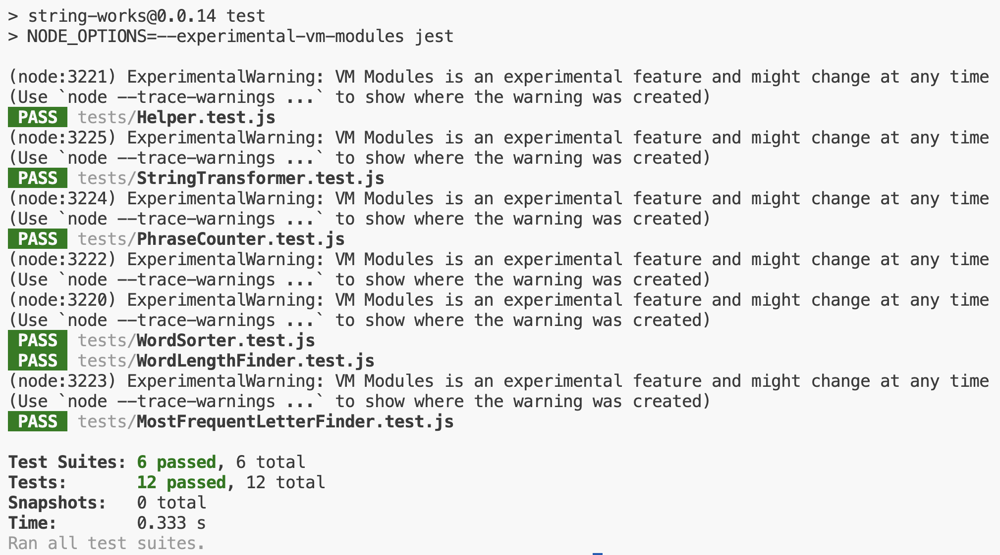

# Testrapport

### Testning i projektet
Testningen har skett främst med manuella tester av enheter och komponenter men även med automatiska enhetstester. Jag ville "testa mycket och testa tidigt" så som vi lärt oss och därför skrev jag automatiska enhetstester till funktioner jag gjort. Testerna gick igenom och jag kände mig nöjd. Problem uppstod dock efter att jag placerat dessa lösa funktioner in i en klass och gjorde dem privata. De gick inte längre att komma åt från testramverket. En del av detta löstes när jag skapade en Helper-klass och lade en del modulgemensamma publika metoder där. Då kunde de enhetstestas i alla fall.

## Testrapport 2025-10-02

**Testad version**: 0.0.14
**Testmiljö**: Visual Studio Code 1.104.2 på MacOS Sequoia 15.6.1

Tester har genomförts på alla publika metoder på två sätt. Dels genom automatiska enhetstester med Jest, dels manuellt genom att anropa alla publika metoder, exklusive de i Helper.js.

### Automatiska enhetstester med Jest

`npm test`



### Manuell testning

`node tests/test-index.js`

```javascript
import { testStr1, testStr2, testStr3, testStr4, testStr5, testStr6 } from "./testStrings.js"

import { stringWorks } from "../src/index.js";

console.log(stringWorks.mostFrequentLetter(testStr1))
console.log(stringWorks.mostFrequentLetterCS(testStr1))
console.log(stringWorks.countSpecifiedPhrase(testStr1, 'g'))
console.log(stringWorks.makeFirstLetterCapital(testStr4))
console.log(stringWorks.findLongestWord(testStr2))
console.log(stringWorks.findShortestWord(testStr2))
```

#### Output
```javascript
[ { i: 148 } ]
[ { i: 147 } ]
5
The Length Of A Name Should Correspond To The Size Of The Scope.
{ numberOfLetters: 20, words: [ 'onsdagseftermiddagen' ] }
{ numberOfLetters: 1, words: [ 'i', 's' ] }
```

### Utfall
Alla automatiska tester gick igenom och output från den manuella testningen visade förväntad output.