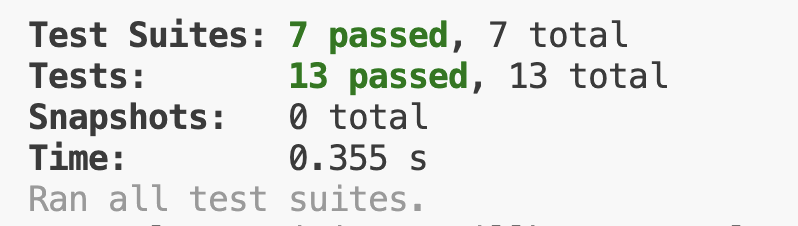

# Testrapport

## Testrapport 2025-11-23

**Testad version**: 0.1.6
**Testmiljö**: Visual Studio Code 1.106.2 på MacOS Sequoia 15.6.1

Tester har genomförts på alla publika metoder på två sätt. Dels genom automatiska enhetstester med Jest, dels manuellt genom att anropa alla publika metoder, exklusive de i Helper.js.

### Automatiska enhetstester med Jest

`npm test`



## Manuell testning

`node tests/test-index.js`

```javascript
import { stringWorks } from "../src/index.js";

const testString1 = 'Lorem Ipsum dolor sit amet consectetur adipisicing elit. Blanditiis, temporibus, nulla ab commodi nobis neque fugit in accusamus, molestias tempore perspiciatis.'

const testString2 = 'The length of a name should correspond to the size of the scope.'
```

### Test 1 - `mostFrequentLetter`

**Input:** `testString1` <br>
**Expected output:** `[ { i: 19 } ]` <br>

```javascript
console.log(stringWorks.mostFrequentLetter(testString1))
```

**Actual output:** `[ { i: 19 } ]` <br>
**Status:** ✅

### Test 2 - `mostFrequentLetterCS`

**Input:** `testString1` <br>
**Expected output:** `[ { i: 18 } ]` <br>

```javascript
console.log(stringWorks.mostFrequentLetterCS(testString1))
```

**Actual output:** `[ { i: 18 } ]` <br>
**Status:** ✅

### Test 3 - `countSpecifiedPhrase`

**Input:** `testString1`, `g` <br>
**Expected output:** `[ { i: 18 } ]` <br>

```javascript
console.log(stringWorks.countSpecifiedPhrase(testString1, 'g'))
```

**Actual output:** `[ { i: 18 } ]` <br>
**Status:** ✅

### Test 4 - `makeFirstLetterCapital`

**Input:** `testString2` <br>
**Expected output:** `The Length Of A Name Should Correspond To The Size Of The Scope.` <br>

```javascript
console.log(stringWorks.makeFirstLetterCapital(testString2))
```

**Actual output:** `The Length Of A Name Should Correspond To The Size Of The Scope.` <br>
**Status:** ✅

### Test 5 - `findLongestWord`

**Input:** `testString1` <br>
**Expected output:** `{ numberOfLetters: 12, words: [ 'perspiciatis' ] }` <br>

```javascript
console.log(stringWorks.findLongestWord(testString1))
```

**Actual output:** `{ numberOfLetters: 12, words: [ 'perspiciatis' ] }` <br>
**Status:** ✅

### Test 6 - `findShortestWord`

**Input:** `testString1` <br>
**Expected output:** `{ numberOfLetters: 2, words: [ 'ab', 'in' ] }` <br>

```javascript
console.log(stringWorks.findShortestWord(testString1))
```

**Actual output:** `{ numberOfLetters: 2, words: [ 'ab', 'in' ] }` <br>
**Status:** ✅

### Test 7 - `countWords`

**Input:** `testString1` <br>
**Expected output:** `21` <br>

```javascript
console.log(stringWorks.countWords(testString1))
```

**Actual output:** `21` <br>
**Status:** ✅

### Test 8 - `countLetters`

**Input:** `testString1` <br>
**Expected output:** `136` <br>

```javascript
console.log(stringWorks.countLetters(testString1))
```

**Actual output:** `136` <br>
**Status:** ✅


### Utfall
Alla automatiska tester gick igenom och output från den manuella testningen visade förväntad output.